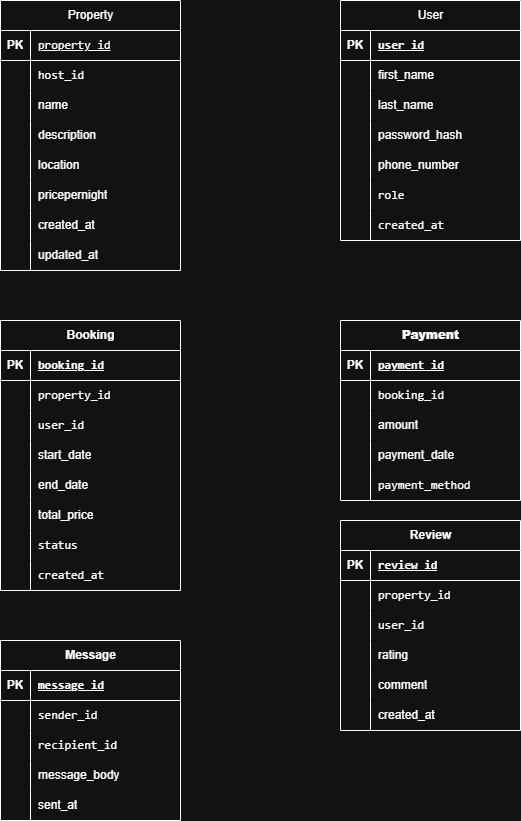

# AirBnB ER Diagram

This ER diagram models the relationships between the core entities in the AirBnB database system.

## Diagram

## Description

- A **User** can be a guest or a host.
- A **Host (User)** can list many **Properties**.
- A **Guest (User)** can make **Bookings** for **Properties**.
- A **Booking** has one **Payment**.
- A **User** can leave **Reviews** for **Properties**.
- **Users** can message each other through the **Message** entity.
